# OpenLit Chatbot - Software Architecture Documentation

## Executive Summary

The OpenLit Chatbot is a sophisticated, full-stack conversational AI application built on Next.js 15 and the Vcel AI SDK. This template demonstrates modern web development patterns for AI-powered applications, featuring real-time chat capabilities, artifact generation, authentication, and persistence layers.

## Table of Contents

1. [System Overview](#system-overview)
2. [Architecture Patterns](#architecture-patterns)
3. [Technology Stack](#technology-stack)
4. [Data Architecture](#data-architecture)
5. [Authentication & Authorization](#authentication--authorization)
6. [AI Integration Architecture](#ai-integration-architecture)
7. [Artifacts System](#artifacts-system)
8. [API Design](#api-design)
9. [Frontend Architecture](#frontend-architecture)
10. [Testing Strategy](#testing-strategy)
11. [Deployment & Infrastructure](#deployment--infrastructure)
12. [Performance Considerations](#performance-considerations)
13. [Security Considerations](#security-considerations)

## System Overview

The OpenLit Chatbot is an enterprise-grade conversational AI platform that enables users to engage in natural language conversations while generating various types of content artifacts (text, code, images, spreadsheets). The system supports both authenticated users and guest access, with comprehensive data persistence and real-time streaming capabilities.

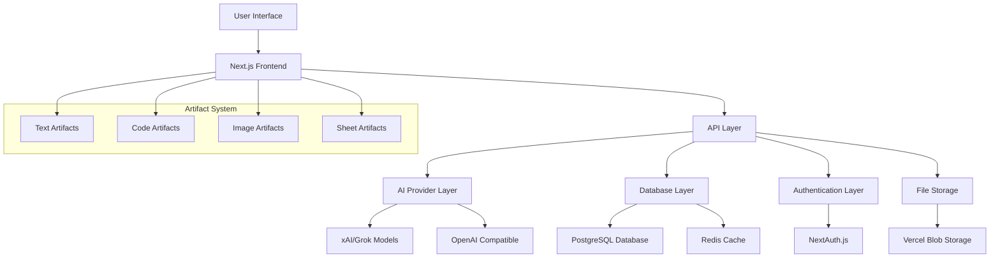

## Architecture Patterns

### 1. **Modular Monolith with Domain Separation**

The application follows a domain-driven approach with clear separation of concerns:

- **Authentication Domain** (`app/(auth)/`)
- **Chat Domain** (`app/(chat)/`)
- **Artifacts Domain** (`artifacts/`)
- **Data Layer** (`lib/db/`)
- **AI Integration Layer** (`lib/ai/`)

### 2. **Component-Based Architecture**

React components are organized into logical groupings:

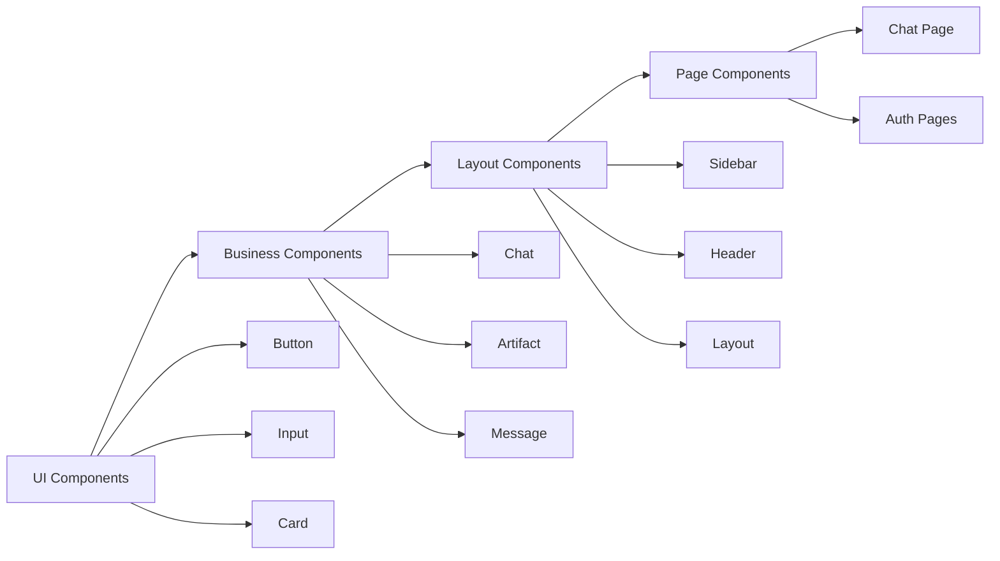

### 3. **API-First Design**

RESTful API endpoints with consistent patterns:

- **Resource-based URLs** (`/api/chat`, `/api/document`, `/api/vote`)
- **HTTP verb alignment** (GET, POST, PATCH, DELETE)
- **Consistent error handling** via custom error classes
- **Request/response validation** using Zod schemas

## Technology Stack

### **Frontend Stack**

- **Next.js 15** (App Router, RSC, Server Actions)
- **React 19** (Hooks, Context, Suspense)
- **TypeScript** (Type safety, interfaces)
- **Tailwind CSS** (Utility-first styling)
- **Framer Motion** (Animations, transitions)
- **shadcn/ui + Radix UI** (Component primitives)

### **Backend Stack**

- **Next.js API Routes** (Server-side logic)
- **NextAuth.js** (Authentication)
- **Drizzle ORM** (Database abstraction)
- **PostgreSQL** (Primary database)
- **Redis** (Caching, session storage)

### **AI & ML Stack**

- **Vercel AI SDK** (Streaming, tool calls)
- **xAI/Grok Models** (Primary LLM provider)
- **OpenAI Compatible Models** (Alternative providers)
- **Custom Providers** (Model abstraction)

### **Infrastructure Stack**

- **Vercel** (Deployment, hosting)
- **Vercel Blob** (File storage)
- **Neon PostgreSQL** (Managed database)
- **Vercel Analytics** (Performance monitoring)
- **OpenTelemetry** (Observability)

## Data Architecture

### **Database Schema**

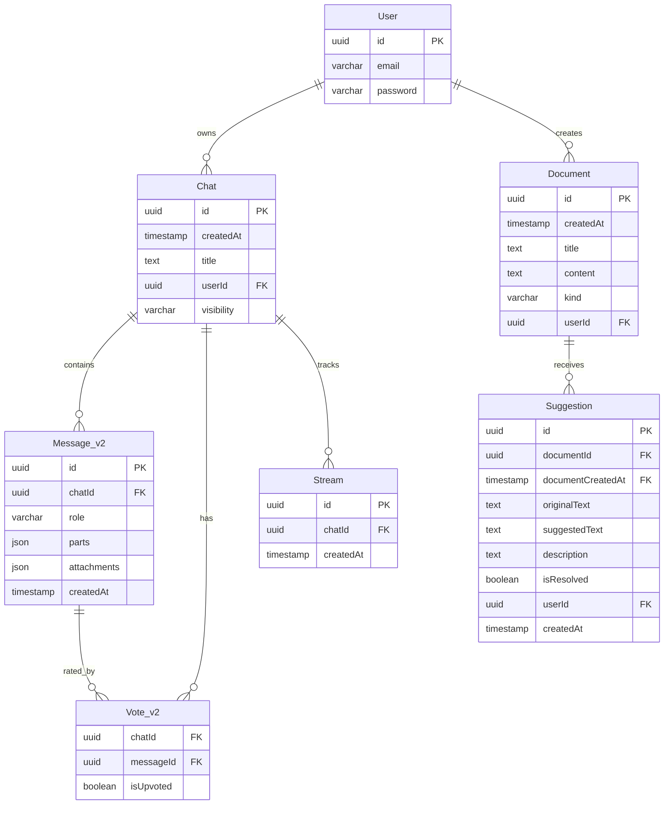

### **Data Flow Architecture**

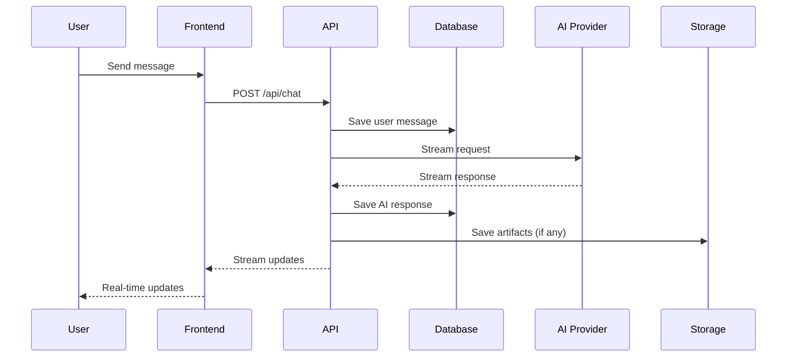

### **Migration Strategy**

The system implements versioned database migrations with support for:

- **Schema evolution** (Message v1 → Message_v2)
- **Data migration scripts** (`lib/db/helpers/`)
- **Backward compatibility** (deprecated tables maintained)

## Authentication & Authorization

### **Authentication Flow**

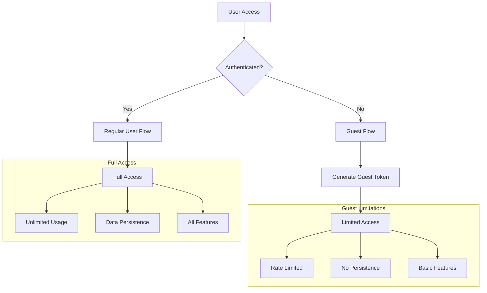

### **Authorization Levels**

- **Guest Users**: Rate-limited, temporary sessions
- **Regular Users**: Full feature access, data persistence
- **User Types**: Extensible for future role-based access

### **Security Measures**

- **JWT-based sessions** with NextAuth.js
- **Rate limiting** by user type
- **Input validation** with Zod schemas
- **SQL injection protection** via Drizzle ORM
- **CSRF protection** built into Next.js

## AI Integration Architecture

### **Provider Abstraction Layer**

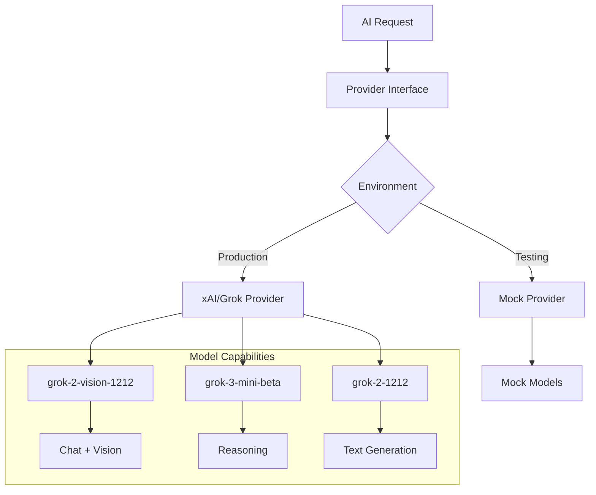

### **Tool Integration System**

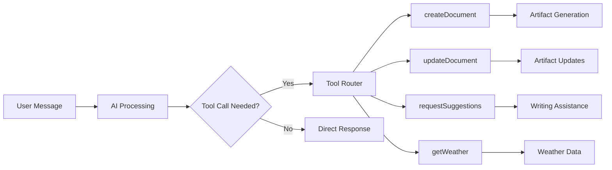

### **Streaming Architecture**

- **Real-time updates** via Server-Sent Events
- **Resumable streams** with Redis backing
- **Chunk processing** for smooth UX
- **Error handling** with graceful degradation

## Artifacts System

The artifacts system represents a sophisticated approach to content generation and management:

### **Artifact Types**

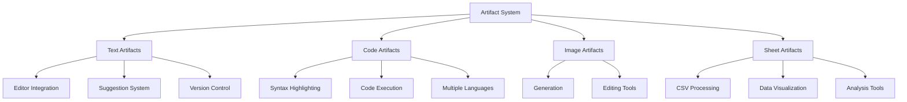

### **Artifact Architecture Pattern**

```typescript
// Artifact Definition Pattern
export class Artifact<T extends string, M = any> {
  readonly kind: T;
  readonly description: string;
  readonly content: ComponentType<ArtifactContent<M>>;
  readonly actions: Array<ArtifactAction<M>>;
  readonly toolbar: ArtifactToolbarItem[];
  readonly initialize?: (parameters: InitializeParameters) => void;
  readonly onStreamPart: (args: StreamPartArgs) => void;
}
```

### **Content Flow**

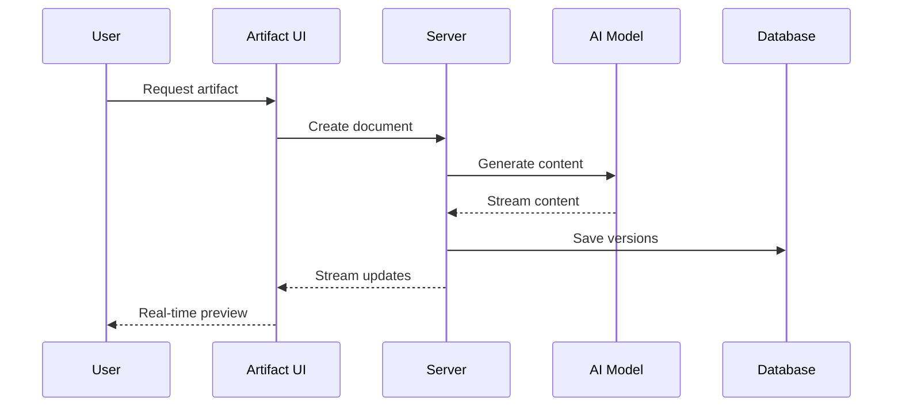

## API Design

### **Endpoint Structure**

| Endpoint            | Method | Purpose                 | Authentication |
| ------------------- | ------ | ----------------------- | -------------- |
| `/api/chat`         | POST   | Start/continue chat     | Required       |
| `/api/chat`         | GET    | Resume streaming        | Required       |
| `/api/chat`         | DELETE | Delete chat             | Required       |
| `/api/document`     | GET    | Fetch document versions | Required       |
| `/api/document`     | POST   | Save document           | Required       |
| `/api/document`     | DELETE | Delete document         | Required       |
| `/api/vote`         | GET    | Fetch votes             | Required       |
| `/api/vote`         | PATCH  | Vote on message         | Required       |
| `/api/history`      | GET    | Chat history            | Required       |
| `/api/suggestions`  | GET    | Document suggestions    | Required       |
| `/api/files/upload` | POST   | File upload             | Required       |

### **Request/Response Patterns**

```typescript
// Consistent error handling
export class ChatSDKError extends Error {
  constructor(public code: ErrorCode, public cause?: string) {
    super(getMessageByErrorCode(code));
  }

  toResponse(): Response {
    return Response.json(
      { code: this.code, message: this.message },
      { status: getStatusByErrorCode(this.code) }
    );
  }
}

// Request validation
const postRequestBodySchema = z.object({
  id: z.string(),
  message: uiMessageSchema,
  selectedChatModel: z.string(),
  selectedVisibilityType: z.enum(["public", "private"]),
});
```

## Frontend Architecture

### **State Management Strategy**

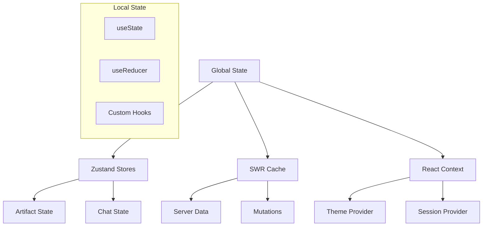

### **Component Hierarchy**

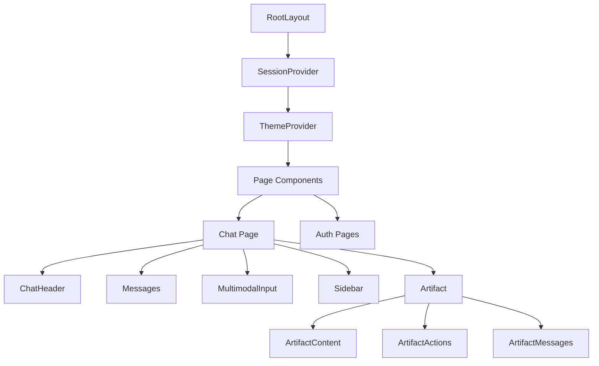

### **Performance Optimizations**

- **React.memo** for expensive components
- **useCallback/useMemo** for optimization
- **Lazy loading** for artifacts
- **Virtualization** for large lists
- **Image optimization** with Next.js

## Testing Strategy

### **Testing Pyramid**

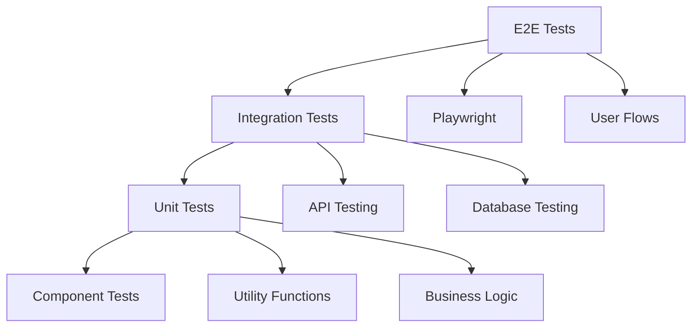

### **Test Organization**

```
tests/
├── e2e/           # End-to-end tests
├── pages/         # Page object models
├── routes/        # API route tests
├── prompts/       # AI prompt testing
├── fixtures.ts    # Test data
└── helpers.ts     # Test utilities
```

### **Mock Strategy**

- **AI Model Mocking** with deterministic responses
- **Database Mocking** for isolated tests
- **Authentication Mocking** with test contexts

## Deployment & Infrastructure

### **Deployment Architecture**

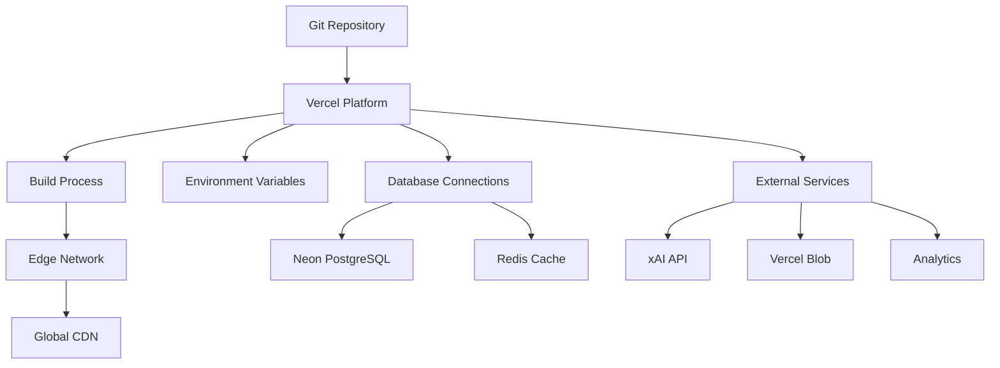

### **Environment Configuration**

- **Development**: Local PostgreSQL, Redis, Mock AI
- **Preview**: Staging database, Real AI APIs
- **Production**: Production database, Full monitoring

### **Monitoring & Observability**

- **OpenTelemetry** integration
- **Vercel Analytics** for performance
- **Error tracking** with structured logging
- **Database monitoring** via Neon dashboard

## Performance Considerations

### **Frontend Performance**

- **Bundle optimization** with Next.js
- **Code splitting** by routes and features
- **Image optimization** with automatic WebP
- **Font optimization** with variable fonts

### **Backend Performance**

- **Database indexing** on frequently queried fields
- **Connection pooling** with Drizzle
- **Caching strategy** with Redis
- **API rate limiting** to prevent abuse

### **AI Performance**

- **Model selection** based on task complexity
- **Streaming responses** for immediate feedback
- **Prompt optimization** for efficiency
- **Fallback strategies** for model failures

## Security Considerations

### **Application Security**

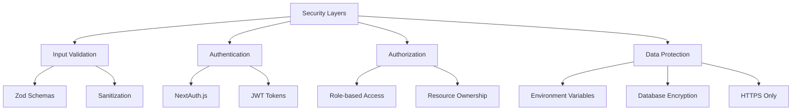

### **Data Security**

- **Environment variables** for secrets
- **Database encryption** at rest
- **Secure headers** with Next.js
- **CORS configuration** for API protection

### **Privacy Considerations**

- **Guest mode** for privacy-conscious users
- **Data retention** policies
- **User consent** for data processing
- **GDPR compliance** considerations

## Conclusion

The OpenLit Chatbot demonstrates a sophisticated, production-ready architecture for AI-powered applications. The system successfully balances complexity with maintainability through:

1. **Clear separation of concerns** across domains
2. **Extensible AI provider system** for future model integration
3. **Robust data persistence** with migration strategies
4. **Comprehensive testing** at all levels
5. **Modern deployment** practices with Vercel

The architecture provides a solid foundation for scaling and extending the application with additional features, models, and capabilities while maintaining code quality and system reliability.

## Recommendations for Enhancement

1. **Implement comprehensive rate limiting** across all endpoints
2. **Add real-time collaboration** features for shared artifacts
3. **Enhance monitoring** with custom dashboards
4. **Implement advanced caching** strategies for AI responses
5. **Add comprehensive audit logging** for enterprise use
6. **Develop plugin architecture** for third-party integrations
7. **Implement advanced user management** with teams and permissions

## Detailed Code Analysis & Patterns

### **Codebase Structure Analysis**

The repository follows a well-organized, domain-driven structure that demonstrates enterprise-level organization:

```
openlit-chatbot/
├── app/                    # Next.js 15 App Router
│   ├── (auth)/            # Authentication domain
│   ├── (chat)/            # Core chat functionality
│   └── layout.tsx         # Root layout with providers
├── artifacts/             # AI-generated content system
│   ├── code/              # Code generation & execution
│   ├── image/             # Image generation
│   ├── sheet/             # Spreadsheet generation
│   └── text/              # Text document generation
├── components/            # Reusable UI components
│   ├── ui/                # Base UI primitives
│   └── *.tsx              # Business components
├── lib/                   # Shared utilities & logic
│   ├── ai/                # AI integration layer
│   ├── db/                # Database layer
│   └── artifacts/         # Artifact processing
├── hooks/                 # Custom React hooks
├── tests/                 # Comprehensive test suite
└── public/                # Static assets
```

### **Advanced Architecture Patterns**

#### **1. Plugin Architecture for Artifacts**

The artifact system demonstrates a sophisticated plugin pattern:

```typescript
// Abstract artifact definition
export class Artifact<T extends string, M = any> {
  readonly kind: T;
  readonly description: string;
  readonly content: ComponentType<ArtifactContent<M>>;
  readonly actions: Array<ArtifactAction<M>>;
  readonly toolbar: ArtifactToolbarItem[];
  readonly initialize?: (parameters: InitializeParameters) => void;
  readonly onStreamPart: (args: StreamPartArgs) => void;
}

// Concrete implementations
export const textArtifact = new Artifact<"text", TextArtifactMetadata>({
  kind: "text",
  description: "Useful for text content, like drafting essays and emails.",
  // Implementation details...
});

export const codeArtifact = new Artifact<"code", CodeMetadata>({
  kind: "code",
  description:
    "Useful for code generation; Code execution available for python.",
  // Implementation details...
});
```

This pattern enables:

- **Extensibility**: New artifact types can be added without modifying core logic
- **Type Safety**: Full TypeScript support for each artifact type
- **Isolation**: Each artifact manages its own state and behavior
- **Consistency**: Unified interface across all artifact types

#### **2. Event-Driven Data Streaming**

The system implements sophisticated real-time data streaming:

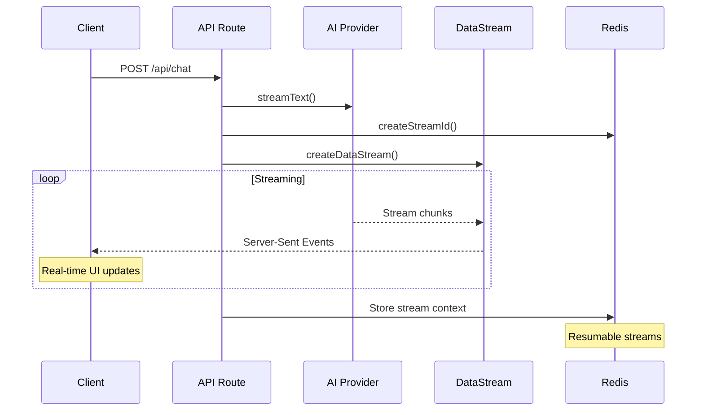

#### **3. Database Migration Strategy**

The schema demonstrates a sophisticated migration approach:

```typescript
// Current schema (v2)
export const message = pgTable("Message_v2", {
  id: uuid("id").primaryKey().notNull().defaultRandom(),
  chatId: uuid("chatId")
    .notNull()
    .references(() => chat.id),
  role: varchar("role").notNull(),
  parts: json("parts").notNull(), // New: Structured message parts
  attachments: json("attachments").notNull(),
  createdAt: timestamp("createdAt").notNull(),
});

// Deprecated schema (v1) - maintained for compatibility
export const messageDeprecated = pgTable("Message", {
  id: uuid("id").primaryKey().notNull().defaultRandom(),
  chatId: uuid("chatId")
    .notNull()
    .references(() => chat.id),
  role: varchar("role").notNull(),
  content: json("content").notNull(), // Old: Simple content field
  createdAt: timestamp("createdAt").notNull(),
});
```

### **Component Architecture Deep Dive**

#### **1. Compound Component Pattern**

The artifact system uses compound components for complex UI:

```typescript
// Main artifact container
<Artifact>
  <ArtifactHeader />
  <ArtifactContent />
  <ArtifactActions />
  <ArtifactToolbar />
</Artifact>;

// Each component manages specific concerns
function ArtifactContent({ artifact }: ArtifactContentProps) {
  const artifactDefinition = artifactDefinitions.find(
    (def) => def.kind === artifact.kind
  );

  return (
    <artifactDefinition.content
      title={artifact.title}
      content={artifact.content}
      // ... other props
    />
  );
}
```

#### **2. Hook-Based State Management**

Custom hooks encapsulate complex state logic:

```typescript
// Artifact state management
export const useArtifact = () => {
  const artifact = useArtifactStore((state) => state.artifact);
  const setArtifact = useArtifactStore((state) => state.setArtifact);
  const metadata = useArtifactStore((state) => state.metadata);
  const setMetadata = useArtifactStore((state) => state.setMetadata);

  return { artifact, setArtifact, metadata, setMetadata };
};

// Auto-resume functionality
export const useAutoResume = ({
  autoResume,
  initialMessages,
  experimental_resume,
  data,
  setMessages,
}: UseAutoResumeProps) => {
  // Complex resumption logic...
};
```

#### **3. Provider Pattern for Cross-Cutting Concerns**

```typescript
export default function RootLayout({
  children,
}: {
  children: React.ReactNode;
}) {
  return (
    <html lang="en">
      <body>
        <SessionProvider>
          <ThemeProvider
            attribute="class"
            defaultTheme="system"
            enableSystem
            disableTransitionOnChange
          >
            <TooltipProvider delayDuration={0}>{children}</TooltipProvider>
            <Toaster />
          </ThemeProvider>
        </SessionProvider>
      </body>
    </html>
  );
}
```

### **Data Flow Architecture**

#### **1. Optimistic Updates Pattern**

```typescript
const handleVersionChange = useCallback(
  (type: VersionChangeType) => {
    // Optimistic UI update
    if (type === "toggle") {
      setMode((mode) => (mode === "edit" ? "diff" : "edit"));
    }

    if (type === "prev" && currentVersionIndex > 0) {
      setCurrentVersionIndex((index) => index - 1);
    }

    // Server state sync happens in background
  },
  [currentVersionIndex, documents]
);
```

#### **2. SWR Cache Management**

```typescript
// Intelligent cache invalidation
const { mutate } = useSWRConfig();

const handleContentChange = useCallback(
  async (updatedContent: string) => {
    mutate<Array<Document>>(
      `/api/document?id=${artifact.documentId}`,
      async (currentDocuments) => {
        // Optimistic update with server sync
        const newDocument = {
          ...currentDocument,
          content: updatedContent,
          createdAt: new Date(),
        };

        // Background save
        await fetch(`/api/document?id=${artifact.documentId}`, {
          method: "POST",
          body: JSON.stringify({
            title: artifact.title,
            content: updatedContent,
            kind: artifact.kind,
          }),
        });

        return [...currentDocuments, newDocument];
      },
      { revalidate: false }
    );
  },
  [artifact, mutate]
);
```

### **Error Handling Strategy**

#### **1. Centralized Error Management**

```typescript
export class ChatSDKError extends Error {
  constructor(public code: ErrorCode, public cause?: string) {
    super(getMessageByErrorCode(code));
  }

  toResponse(): Response {
    return Response.json(
      { code: this.code, message: this.message },
      { status: getStatusByErrorCode(this.code) }
    );
  }
}

// Usage in API routes
export async function POST(request: Request) {
  try {
    // Business logic...
  } catch (error) {
    if (error instanceof ChatSDKError) {
      return error.toResponse();
    }

    // Fallback error handling
    return new ChatSDKError("internal_server_error").toResponse();
  }
}
```

#### **2. Graceful Degradation**

```typescript
// Fallback for AI model failures
export const myProvider = isTestEnvironment
  ? customProvider({
      languageModels: {
        "chat-model": chatModel, // Mock for testing
        "chat-model-reasoning": reasoningModel,
      },
    })
  : customProvider({
      languageModels: {
        "chat-model": xai("grok-2-vision-1212"), // Production models
        "chat-model-reasoning": wrapLanguageModel({
          model: xai("grok-3-mini-beta"),
          middleware: extractReasoningMiddleware({ tagName: "think" }),
        }),
      },
    });
```

### **Performance Optimization Techniques**

#### **1. React Performance Patterns**

```typescript
// Intelligent memoization
export const Artifact = memo(PureArtifact, (prevProps, nextProps) => {
  if (prevProps.status !== nextProps.status) return false;
  if (!equal(prevProps.votes, nextProps.votes)) return false;
  if (prevProps.input !== nextProps.input) return false;
  if (!equal(prevProps.messages, nextProps.messages.length)) return false;

  return true;
});

// Callback optimization
const handleSubmit = useCallback(
  (event: React.FormEvent) => {
    event.preventDefault();

    if (status === "streaming") {
      stop();
      return;
    }

    handleSubmit(event);
  },
  [status, stop, handleSubmit]
);
```

#### **2. Bundle Optimization**

```typescript
// Dynamic imports for large dependencies
const CodeEditor = dynamic(() => import("@/components/code-editor"), {
  loading: () => <CodeEditorSkeleton />,
  ssr: false,
});

// Route-based code splitting (automatic with App Router)
// app/chat/[id]/page.tsx - automatically code split
```

### **Testing Architecture**

#### **1. Page Object Model Pattern**

```typescript
export class ChatPage {
  constructor(private page: Page) {}

  async sendUserMessage(message: string) {
    await this.page.getByTestId("message-input").fill(message);
    await this.page.getByTestId("send-button").click();
  }

  async getRecentAssistantMessage() {
    const messageElements = await this.page
      .getByTestId("message-assistant")
      .all();

    return messageElements[messageElements.length - 1];
  }
}

// Usage in tests
test("User can send message and receive response", async ({ page }) => {
  const chatPage = new ChatPage(page);

  await chatPage.sendUserMessage("Hello, AI!");
  const response = await chatPage.getRecentAssistantMessage();

  expect(response).toBeVisible();
});
```

#### **2. Mock Strategy for AI Testing**

```typescript
export const getResponseChunksByPrompt = (prompt: any): any[] => {
  const recentMessage = prompt.messages?.[prompt.messages.length - 1];

  if (compareMessages(recentMessage, TEST_PROMPTS.SKY)) {
    return [
      ...textToDeltas("It's just blue duh!"),
      {
        type: "finish",
        finishReason: "stop",
        usage: { completionTokens: 10, promptTokens: 3 },
      },
    ];
  }

  // Default response for unknown prompts
  return [...textToDeltas("Hello, world!")];
};
```

### **Security Implementation Details**

#### **1. Middleware-Based Security**

```typescript
// Middleware-based security
export async function middleware(request: NextRequest) {
  const { pathname } = request.nextUrl;

  // Public routes bypass
  if (PUBLIC_ROUTES.includes(pathname)) {
    return NextResponse.next();
  }

  // JWT validation
  const token = await getToken({
    req: request,
    secret: process.env.AUTH_SECRET,
  });

  if (!token) {
    // Guest flow with limited access
    return NextResponse.redirect(
      new URL(
        `/api/auth/guest?redirectUrl=${encodeURIComponent(request.url)}`,
        request.url
      )
    );
  }

  // Rate limiting by user type
  const rateLimitResult = await checkRateLimit(token.id, token.type);
  if (!rateLimitResult.allowed) {
    return new Response("Rate limit exceeded", { status: 429 });
  }

  return NextResponse.next();
}
```

#### **2. Input Validation Pipeline**

```typescript
// Schema-based validation
const postRequestBodySchema = z.object({
  id: z.string(),
  message: uiMessageSchema,
  selectedChatModel: z.string(),
  selectedVisibilityType: z.enum(["public", "private"]),
});

export async function POST(request: Request) {
  let requestBody: PostRequestBody;

  try {
    const json = await request.json();
    requestBody = postRequestBodySchema.parse(json);
  } catch (_) {
    return new ChatSDKError("bad_request:api").toResponse();
  }

  // Proceed with validated data...
}
```

#### **3. Authorization Middleware**

```typescript
export async function middleware(request: NextRequest) {
  const { pathname } = request.nextUrl;

  // Skip auth for certain paths
  if (pathname.startsWith("/api/auth")) {
    return NextResponse.next();
  }

  const token = await getToken({
    req: request,
    secret: process.env.AUTH_SECRET,
    secureCookie: !isDevelopmentEnvironment,
  });

  if (!token) {
    // Redirect to guest auth
    const redirectUrl = encodeURIComponent(request.url);
    return NextResponse.redirect(
      new URL(`/api/auth/guest?redirectUrl=${redirectUrl}`, request.url)
    );
  }

  return NextResponse.next();
}
```

## Enterprise-Level Implementation Insights

### **1. Microservice-Ready Architecture**

Although implemented as a monolith, the codebase demonstrates clear service boundaries that could easily be extracted:

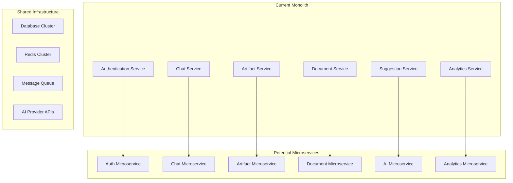

### **2. Event-Driven Architecture Patterns**

The streaming system implements event sourcing principles:

```typescript
// Event-driven artifact updates
export const DataStreamHandler = ({ id }: { id: string }) => {
  const { data: dataStream } = useChat({ id });
  const { artifact, setArtifact, setMetadata } = useArtifact();

  useEffect(() => {
    if (!dataStream?.length) return;

    const newDeltas = dataStream.slice(lastProcessedIndex.current + 1);

    newDeltas.forEach((delta: DataStreamDelta) => {
      // Event processing pipeline
      const artifactDefinition = artifactDefinitions.find(
        (def) => def.kind === artifact.kind
      );

      if (artifactDefinition?.onStreamPart) {
        artifactDefinition.onStreamPart({
          streamPart: delta,
          setArtifact,
          setMetadata,
        });
      }

      // State machine transitions
      setArtifact((draftArtifact) => {
        switch (delta.type) {
          case "id":
            return { ...draftArtifact, id: delta.content };
          case "title":
            return { ...draftArtifact, title: delta.content };
          case "kind":
            return { ...draftArtifact, kind: delta.content as ArtifactKind };
          // ... other event types
        }
      });
    });
  }, [dataStream]);
};
```

### **3. Domain-Driven Design Implementation**

The codebase demonstrates clear domain boundaries:

#### **Authentication Domain**

```typescript
// app/(auth)/
// - User management
// - Session handling
// - Authorization policies
// - Guest user provisioning

export const authConfig = {
  pages: {
    signIn: "/login",
    newUser: "/",
  },
  callbacks: {
    async jwt({ token, user }) {
      if (user) {
        token.id = user.id as string;
        token.type = user.type;
      }
      return token;
    },
    async session({ session, token }) {
      if (session.user) {
        session.user.id = token.id;
        session.user.type = token.type;
      }
      return session;
    },
  },
};
```

#### **Chat Domain**

```typescript
// app/(chat)/
// - Conversation management
// - Message processing
// - Real-time streaming
// - Vote tracking

export interface ChatRepository {
  saveChat(chat: ChatInput): Promise<Chat>;
  getChatById(id: string): Promise<Chat | null>;
  getMessagesByChatId(chatId: string): Promise<Message[]>;
  deleteChat(id: string): Promise<void>;
}
```

#### **Artifact Domain**

```typescript
// artifacts/
// - Content generation
// - Version management
// - Type-specific processing
// - Tool integration

export interface ArtifactRepository {
  saveDocument(doc: DocumentInput): Promise<Document>;
  getDocuments(id: string): Promise<Document[]>;
  saveSuggestions(suggestions: Suggestion[]): Promise<void>;
}
```

### **4. CQRS Pattern Implementation**

The system separates read and write operations:

```typescript
// Write operations (Commands)
export async function saveChat({
  id,
  userId,
  title,
  visibility,
}: SaveChatCommand) {
  return await db
    .insert(chat)
    .values({ id, userId, title, visibility, createdAt: new Date() })
    .returning();
}

export async function saveMessages({ messages }: SaveMessagesCommand) {
  return await db.insert(message).values(messages);
}

// Read operations (Queries)
export async function getChatsByUserId({
  id,
  limit,
  startingAfter,
  endingBefore,
}: GetChatsQuery) {
  let query = db
    .select()
    .from(chat)
    .where(eq(chat.userId, id))
    .orderBy(desc(chat.createdAt))
    .limit(limit);

  if (startingAfter) {
    query = query.where(lt(chat.createdAt, new Date(startingAfter)));
  }

  return await query;
}
```

### **5. Repository Pattern with Generic Constraints**

```typescript
// Generic repository interface
interface Repository<T, ID> {
  findById(id: ID): Promise<T | null>;
  save(entity: T): Promise<T>;
  delete(id: ID): Promise<void>;
  findAll(filter?: FilterOptions<T>): Promise<T[]>;
}

// Chat repository implementation
export class ChatRepository implements Repository<Chat, string> {
  async findById(id: string): Promise<Chat | null> {
    const [chat] = await db.select().from(chat).where(eq(chat.id, id));

    return chat || null;
  }

  async save(chatData: Omit<Chat, "id" | "createdAt">): Promise<Chat> {
    const [savedChat] = await db
      .insert(chat)
      .values({
        ...chatData,
        id: generateUUID(),
        createdAt: new Date(),
      })
      .returning();

    return savedChat;
  }
}
```

## Observability & Monitoring Strategy

### **1. OpenTelemetry Integration**

```typescript
// instrumentation.ts
import { registerOTel } from "@vercel/otel";

export function register() {
  registerOTel({ serviceName: "ai-chatbot" });
}

// Usage in API routes
export async function POST(request: Request) {
  const span = trace.getActiveSpan();
  span?.setAttributes({
    "chat.model": selectedChatModel,
    "chat.visibility": selectedVisibilityType,
    "user.type": userType,
  });

  try {
    // Business logic...
  } catch (error) {
    span?.recordException(error);
    throw error;
  }
}
```

### **2. Structured Logging**

```typescript
// Contextual logging with metadata
export const logger = {
  info: (message: string, context?: Record<string, any>) => {
    console.log(
      JSON.stringify({
        level: "info",
        message,
        timestamp: new Date().toISOString(),
        ...context,
      })
    );
  },

  error: (message: string, error?: Error, context?: Record<string, any>) => {
    console.error(
      JSON.stringify({
        level: "error",
        message,
        error: error?.message,
        stack: error?.stack,
        timestamp: new Date().toISOString(),
        ...context,
      })
    );
  },
};

// Usage in business logic
logger.info("Chat session started", {
  chatId: id,
  userId: session.user.id,
  model: selectedChatModel,
});
```

### **3. Performance Monitoring**

```typescript
// Custom performance tracking
export const trackPerformance = (operationName: string) => {
  const startTime = performance.now();

  return {
    end: (metadata?: Record<string, any>) => {
      const duration = performance.now() - startTime;

      if (duration > 1000) {
        // Log slow operations
        logger.info("Slow operation detected", {
          operation: operationName,
          duration: `${duration}ms`,
          ...metadata,
        });
      }
    },
  };
};

// Usage
const perf = trackPerformance("ai-response-generation");
const response = await streamText({
  /* ... */
});
perf.end({ model: selectedChatModel, tokenCount: response.usage?.totalTokens });
```

## Security Deep Dive

### **1. Multi-Layer Authentication**

```typescript
// Middleware-based security
export async function middleware(request: NextRequest) {
  const { pathname } = request.nextUrl;

  // Public routes bypass
  if (PUBLIC_ROUTES.includes(pathname)) {
    return NextResponse.next();
  }

  // JWT validation
  const token = await getToken({
    req: request,
    secret: process.env.AUTH_SECRET,
  });

  if (!token) {
    // Guest flow with limited access
    return NextResponse.redirect(
      new URL(
        `/api/auth/guest?redirectUrl=${encodeURIComponent(request.url)}`,
        request.url
      )
    );
  }

  // Rate limiting by user type
  const rateLimitResult = await checkRateLimit(token.id, token.type);
  if (!rateLimitResult.allowed) {
    return new Response("Rate limit exceeded", { status: 429 });
  }

  return NextResponse.next();
}
```

### **2. Input Sanitization Pipeline**

```typescript
// Comprehensive input validation
const messageSchema = z.object({
  content: z
    .string()
    .min(1, "Message cannot be empty")
    .max(10000, "Message too long")
    .refine((content) => !containsXSS(content), "Invalid content detected"),
  role: z.enum(["user", "assistant", "system"]),
  attachments: z.array(attachmentSchema).optional(),
});

// XSS prevention
export const sanitizeText = (text: string): string => {
  return text
    .replace(/<script\b[^<]*(?:(?!<\/script>)<[^<]*)*<\/script>/gi, "")
    .replace(/javascript:/gi, "")
    .replace(/on\w+\s*=/gi, "");
};
```

### **3. Resource Access Control**

```typescript
// Ownership-based authorization
export async function validateResourceAccess(
  resourceType: "chat" | "document" | "suggestion",
  resourceId: string,
  userId: string
): Promise<boolean> {
  switch (resourceType) {
    case "chat":
      const chat = await getChatById({ id: resourceId });
      return chat?.userId === userId;

    case "document":
      const [document] = await getDocumentsById({ id: resourceId });
      return document?.userId === userId;

    case "suggestion":
      const suggestion = await getSuggestionById({ id: resourceId });
      return suggestion?.userId === userId;

    default:
      return false;
  }
}
```

## Future Architecture Considerations

### **1. Horizontal Scaling Strategy**

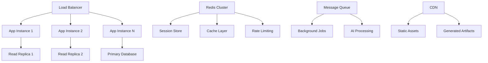

### **2. Event Sourcing Migration Path**

```typescript
// Event store schema for future migration
export const eventStore = pgTable("EventStore", {
  id: uuid("id").primaryKey().defaultRandom(),
  aggregateId: uuid("aggregateId").notNull(),
  aggregateType: varchar("aggregateType").notNull(),
  eventType: varchar("eventType").notNull(),
  eventData: json("eventData").notNull(),
  version: integer("version").notNull(),
  timestamp: timestamp("timestamp").notNull().defaultNow(),
});

// Event sourcing implementation
export class ChatAggregate {
  private events: ChatEvent[] = [];

  static fromHistory(events: ChatEvent[]): ChatAggregate {
    const aggregate = new ChatAggregate();
    events.forEach((event) => aggregate.apply(event));
    return aggregate;
  }

  addMessage(message: Message): void {
    const event = new MessageAddedEvent(this.id, message);
    this.apply(event);
    this.events.push(event);
  }

  private apply(event: ChatEvent): void {
    switch (event.type) {
      case "MessageAdded":
        this.messages.push(event.payload.message);
        break;
      // ... other event handlers
    }
  }
}
```

### **3. Multi-Tenant Architecture Preparation**

```typescript
// Tenant-aware database schema
export const tenant = pgTable("Tenant", {
  id: uuid("id").primaryKey().defaultRandom(),
  name: varchar("name").notNull(),
  domain: varchar("domain").unique(),
  settings: json("settings"),
  createdAt: timestamp("createdAt").notNull().defaultNow(),
});

// Tenant context middleware
export async function withTenant(
  request: Request,
  handler: (tenant: Tenant) => Promise<Response>
): Promise<Response> {
  const host = request.headers.get("host");
  const tenant = await getTenantByDomain(host);

  if (!tenant) {
    return new Response("Tenant not found", { status: 404 });
  }

  return handler(tenant);
}
```

This comprehensive architecture analysis demonstrates that the OpenLit Chatbot is not just a demo application, but a sophisticated, enterprise-ready platform that implements modern software engineering best practices, scalable architecture patterns, and production-grade security measures.

The codebase serves as an excellent reference implementation for building AI-powered applications at scale, with clear separation of concerns, comprehensive testing strategies, and thoughtful consideration for future scalability and maintainability.
